# HUB! Plataforma — Guía de uso

> Este documento te lleva del día 0 al día 30 operando el bar con la plataforma.
> Está pensado para que **Luz y Joaquin** (gestoras de reservas) y el dueño puedan
> empezar a usar el sistema sin ayuda externa.

---

## 1. Conceptos en 60 segundos

**¿Qué hace el sistema?**

1. **Captura quién viene al bar.** Cada reserva guarda nombre, teléfono y opt-in para marketing.
2. **Calcula automáticamente las comisiones** de Luz y Joaquin según las reglas del bar (tarifa por tipo de servicio × cantidad real de personas + bonus si el evento se llena).
3. **Muestra en vivo a los mozos** qué reservas tienen pendientes, quién llegó, qué mesa hay que cerrar.
4. **Programa los eventos del mes** (Sushi Libre, Pizza Libre, Ramen, etc.) con su cupo, fecha y horario configurables.

**Roles:**

| Rol | Quién | Qué puede |
|---|---|---|
| **Owner** | Dueño del bar | Todo: ve plata, edita tarifas, gestiona staff, ve estadísticas |
| **Cashier** | Cajero | Crea/edita reservas, gestiona eventos programados, opera panel del salón |
| **Waiter** | Mozo | Solo opera panel del salón (marcar llegó, sentar, cerrar mesa) |

---

## 2. Flujo completo del sistema



---

## 3. Setup inicial (una sola vez)

### 3.1 Acceso al sistema

URL de producción: `https://hubbar.vercel.app`

Usuario inicial: el dueño se loguea con su email/password. Para invitar a Luz y Joaquin como gestoras, ir a:

```
Ajustes → Configuración → Equipo → Invitar
```

Asignarles rol **cashier** (pueden crear reservas + gestionar eventos pero no ven comisiones).

### 3.2 Configuración base ya hecha al iniciar el sistema

| Configuración | Valor actual | Dónde editar |
|---|---|---|
| Capacidades del salón | Planta Alta: 60 · Planta Baja: 80 | `Ajustes → Configuración → Salón` |
| Gestores con comisión | Luz · Joaquin | `Ajustes → Configuración → Comisiones → Gestores` |
| Tarifas (Almuerzo/Merienda/Desayuno) | $140 (1-7) · $160 (8-15) · $180 (16-30) · $220 (31+) por persona | `Ajustes → Configuración → Comisiones → Tarifas` |
| Tarifas (Cena) | $90 · $120 · $130 · $140 por persona | mismo lugar |
| Bonus evento lleno | $200/persona al alcanzar 100% del cupo | `Ajustes → Configuración → Comisiones → Bonus full` |

### 3.3 Templates de eventos programados (a crear)

> Después del borrado profundo no hay templates. Los podés crear desde:

```
Eventos → Templates → + Nuevo template
```

Templates típicos que conviene crear (con colores que después se ven en el calendario y el panel):

| Nombre | Slug | Cupo default | Color sugerido |
|---|---|---|---|
| Sushi Libre | `sushi-libre` | 40 | Celeste `#0ea5e9` |
| Pizza Libre | `pizza-libre` | 50 | Naranja `#f97316` |
| Ramen | `ramen` | 30 | Rojo `#dc2626` |
| Mariscos y Vino | `mariscos-y-vino` | 35 | Verde mar `#14b8a6` |
| Noche Astral | `noche-astral` | 60 | Violeta `#7c3aed` |
| Noche de Magia | `noche-de-magia` | 60 | Magenta `#a855f7` |

**Toggle "Consume cupo en cumples":** si está prendido, cuando un cumpleaños pide ese formato consume del cupo del evento programado (recomendado para Sushi/Pizza/Ramen/Mariscos). Si está apagado, el cupo del cumple es independiente (recomendado para Astral/Magia).

---

## 4. Flujo diario: cargar una reserva (Luz/Joaquin)

> **Tiempo objetivo: menos de 30 segundos** por reserva.

### Paso 1 — Abrir el form

Desde el sidebar: `Clientes → Reservas → + Nueva reserva`
O directo a `https://hubbar.vercel.app/hub/reservas/nuevo`.

### Paso 2 — Buscar o crear cliente

Tipea las primeras letras del nombre o teléfono en el primer campo. El autocomplete muestra hasta 8 clientes del CRM. Si aparece el correcto, tocalo; si no, dejá el nombre escrito y el teléfono y el sistema crea el cliente al guardar.

**Cuándo aparece el ✓ verde "Cliente vinculado al CRM":** cuando seleccionaste uno existente o el teléfono coincide con uno ya guardado. Esto permite que el cliente acumule visitas / puntos.

### Paso 3 — Fecha y horario

Tres opciones rápidas (chips): **Hoy · Mañana · Sábado**. Si necesitás otra fecha, tap en el campo y elegí del calendario nativo.

Default de horario: 21:30 (modificable).

### Paso 4 — Tipo de servicio

Tap en uno de los 5 botones: Desayuno · Almuerzo · Merienda · Cena · Evento HUB.
Esto define qué tabla de tarifa aplica a la comisión.

### Paso 5 — Zona

Tres cards: **Planta Alta · Planta Baja · Sujeta a evento**.
- **Planta Alta / Baja**: la reserva consume cupo de esa zona.
- **Sujeta a evento**: obliga a elegir un evento programado del día (paso 6).

### Paso 6 — Tipo de reserva

Tres botones: **Normal · Cumpleaños · Reserva especial**.
- Si elegís **Cumpleaños**: aparecen steppers de "Tortas que traen" (0-2) y "Champagne que traen" (0-2).
- Si elegís **Reserva especial** o **Sujeta a evento**: aparece selector de evento programado para esa fecha.

### Paso 7 — Personas

Stepper grande con + y −. Default = 2. Min = 1, max = 99.

A medida que sumás personas, la **barra de capacidad inline** se llena visualmente:
- Verde: hay lugares libres
- Amarillo: cerca del límite
- Rojo: overbooking (el sistema te avisa pero NO bloquea — los bares aceptan voluntariamente)

### Paso 8 — Quién gestionó

- **Gestor principal**: por defecto, el último que vos usaste (guardado en `localStorage`). Cambialo si gestionó alguien más.
- **Asistente (opcional)**: si la reserva la trabajaron entre dos, agregalo acá. Si ambos cobran comisión, se splittea **50/50 automáticamente** (con redondeo: si es impar, el principal se lleva el peso extra).

### Paso 9 — Origen

5 botones: WhatsApp Hub · Instagram Hub · Messenger Hub · Presencial Hub · Amigo/Conocido de socio.

### Paso 10 — Extras

- **Seña ARS**: monto que dejaron como reserva (en pesos, el sistema lo guarda en centavos).
- **Comentarios**: texto libre. Buen lugar para "2 vegetarianos · 1 mesa de fumadores · tienen promo 2x1".

### Paso 11 — Comisión estimada

Antes de submit, el sistema te muestra abajo en el footer sticky:

> **Comisión estimada: $X.XXX**

Eso es lo que va a cobrar el/los gestor/es cuando se cierre la mesa con esa cantidad real.

### Paso 12 — Guardar

Tap el botón **Crear reserva** o atajo de teclado **⌘+Enter** (Mac) / **Ctrl+Enter** (Windows).

Toast verde: "Reserva creada". El sistema te redirige al detalle.

---

## 5. Flujo del día del servicio (mozos)

### Acceder al panel operativo

**Desde sidebar:** `Hoy → Operativo` (abre en nueva pestaña, idealmente en tablet horizontal).

URL directa: `https://hubbar.vercel.app/hub/salon/reservas-operativo`

### Lo que ves

Header sticky arriba muestra:
- **Fecha** (navegable con ← y →)
- **Total de reservas** del día + contadores por estado (Pend / Llegó / Sent / Cerr)
- **Barras de capacidad** por zona y por evento programado del día
  - Verde si hay lugar
  - Amarillo si está cerca del 100% (parpadea "¡Casi lleno!")
  - Rojo si hay overbooking

Debajo, 3 columnas: **Planta Alta · Planta Baja · Sujeta a evento**.
Cada columna lista las reservas del día ordenadas por hora.

### Cada card de reserva muestra:

- Hora
- Nombre del cliente
- 🎂 si trae torta, 🍾 si trae champagne
- Cantidad de personas
- Gestor responsable
- Comentarios (si los hay)
- Borde de color según estado

### Cambiar estado de una reserva (1 tap)

Tap la card → se abre **bottom sheet** con 3 botones grandes:
1. **Llegó** (azul) — cuando el cliente llegó al salón
2. **Sentar** (verde) — cuando lo sentaste en una mesa
3. **Cerrar mesa** (gris) — cuando terminaron y pagaron

Adicionalmente:
- **No vino** (rojo) — si pasa la hora y no aparecieron
- **Revertir estado** — si te equivocaste (por ej., marcaste sentado pero no estaba)

### Cuando cerrás una mesa

El sistema te pide **confirmar la cantidad real** de personas (puede ser distinta a la estimada). Tap + / − para ajustar, después **Cerrar**.

**Qué pasa en ese momento (automático):**
1. Se guardan `closed_at` y `actual_guests`
2. **Se calcula la comisión** según las tarifas vigentes
3. Si el cierre completa el cupo del evento al 100% → **se recalcula con bonus** TODAS las reservas de ese evento (no solo la actual)

### Tiempo real en todas las tablets

Si hay 2 tablets abiertas, los cambios de estado aparecen automáticamente en ambas (Supabase Realtime + animación). El header de capacidad se actualiza solo.

---

## 6. Programar eventos del mes (Luz/Joaquin/Cajero)

> **Caso de uso:** "Necesito agendar Sushi Libre para el viernes 30, capacidad 40 personas."

### Paso 1 — Calendar mensual

`Eventos → Eventos → tab Programados` (o link directo: `/hub/eventos/programados`).

Calendario en grilla con días del mes. Cada día puede tener 0..N eventos como chips de color.

### Paso 2 — Crear instancia

- Tap el `+` que aparece al hover en una celda de día, o
- Botón **+ Programar evento** arriba.

Form:
- **Template** (Sushi Libre, Pizza Libre, etc. — autocompletar capacidad default + meal_type)
- **Fecha**
- **Inicio** (default 21:00) y **Fin** (opcional)
- **Cupo** (heredado del template, editable)
- **Servicio** (Desayuno/Almuerzo/Merienda/Cena/Evento HUB — afecta qué tarifa aplica)
- **Nombre custom** opcional (ej: "Sushi Libre San Valentín")
- **Notas internas**
- **Bonus por evento lleno**: ON por default. Si lo apagás, no aplica el bonus aunque se llene.

### Paso 3 — Editar / borrar

Tap el chip del día en el calendario → entrás al detalle. Ahí podés:
- Editar capacidad, horario, notas
- Ver las reservas ya asociadas al evento
- Borrar (solo si no hay reservas activas atadas)

---

## 7. Liquidar comisiones (solo Owner)

> **Caso de uso:** "Fin de mes, le tengo que pagar a Luz y Joaquin."

### Paso 1 — Abrir liquidación

Sidebar: `Insights → Comisiones`. Default = mes actual.

### Paso 2 — Vista general

- 3 tarjetas grandes: **Total a liquidar · Ya cobrado · Pendiente**
- **Donut chart**: distribución entre gestores
- **Tabla** por gestor con columnas: Reservas, Personas, Base, Bonus, Total, Cobrado, Pendiente

### Paso 3 — Drill-down por gestor

Tap **Detalle** en la fila de Luz (o Joaquin). Ves:
- Cada reserva con su fecha, cliente, tarifa aplicada, base, bonus, total, split, estado.
- **Badge "est"** en cantidad: significa que la mesa se cerró sin cargar `actual_guests` → se comisiona por estimado.
- **Checkbox** para marcar como pagadas en bloque.

### Paso 4 — Marcar como pagadas

1. Tildeás las que vas a pagar (o el toggle de header para todas pendientes).
2. Aparece un banner sticky amarillo: "X entries seleccionadas".
3. Tap **Marcar como cobradas**.
4. El sistema graba `paid_at = ahora`. Esas entries quedan **inmutables** (ningún recálculo las toca).

### Paso 5 — Pagar offline

El sistema NO transfiere plata. Le pagás a Luz/Joaquin por el medio que acuerdes (efectivo / transferencia / etc.) y dejás registro en el sistema marcándolas como cobradas.

### Recálculo retroactivo

Si después del cierre cambiás:
- La cantidad real → se recalcula esa entry (si no está pagada)
- El gestor → se recalcula
- Las tarifas mid-mes → solo afecta entries futuras y entries que aún no fueron pagadas

Entries con `paid_at != null` son intocables: el snapshot del rate aplicado queda congelado.

---

## 8. Cuentas operativas — FAQ rápido

| Pregunta | Respuesta |
|---|---|
| ¿Qué pasa si cargo una reserva con más personas que la capacidad? | Te avisa en amarillo/rojo pero no bloquea (overbooking voluntario). |
| ¿Puedo borrar una reserva ya cerrada? | Sí, pero las comisiones pagadas no se reversan. |
| ¿Qué pasa si me equivoco al cerrar una mesa? | "Revertir estado" → vuelve a "Sentada". La comisión se recalcula. |
| ¿Cómo veo todas las reservas del mes? | `Clientes → Reservas` (con filtros por gestor, zona, estado, rango de fechas). |
| ¿El cliente se entera de su reserva por WhatsApp? | NO en MVP. La mensajería está desactivada. Solo email/WhatsApp manual desde el bar. |
| ¿Puedo cambiar el gestor de una reserva después de creada? | Sí, desde el detalle (`/reservas/[id]`). Recalcula automáticamente. |
| ¿Cómo agrego un gestor nuevo? | `Ajustes → Configuración → Comisiones → Gestores → + Nuevo`. Marcalo como `commission_eligible` si va a cobrar. |
| ¿Dónde veo qué eventos tengo este mes? | `Eventos → Programados` (calendario mensual). |
| ¿Cómo restauro las tarifas a los valores HUB originales? | Editás cada tier manualmente desde `Ajustes → Configuración → Comisiones → Tarifas`. Valores HUB están al inicio de esta guía. |
| ¿Quién ve las comisiones? | Solo el **owner**. Los gestores no ven cuánto van cobrando (por ahora). |

---

## 9. Glosario rápido

| Término | Significado |
|---|---|
| **Reserva normal** | Reserva regular, sin formato especial |
| **Cumpleaños** | Reserva con extras: tortas + champagne que trae el cliente |
| **Reserva especial / Evento HUB** | Reserva grande con formato definido (Sushi Libre, etc.) |
| **Sujeta a evento** | Zona virtual — la reserva consume del cupo del evento, no de PA/PB |
| **Bucket** | "Caja" donde se contabiliza la capacidad (zona física o evento programado) |
| **Tier de tarifa** | Rango de personas con un valor por persona (ej: 8-15 personas → $120) |
| **Commission ledger** | Tabla con todas las comisiones devengadas. Una entry por reserva × gestor. |
| **Split 50/50** | Cuando ambos gestores cobran, la comisión se divide en partes iguales (con el primario llevando el peso extra si es impar) |
| **Snapshot** | Foto congelada de las tarifas aplicadas al momento de calcular la comisión — auditable a futuro |
| **Realtime** | Cambios que aparecen automáticamente en las tablets sin recargar |

---

## 10. Soporte / Reportar bugs

Si algo se rompe:
1. **Reload** primero (90% de los errores raros se resuelven).
2. Si persiste, anotá la **URL completa**, qué hacías y el mensaje exacto.
3. Mandalo a soporte (canal interno del bar).

---

> *HUB! Coffee & Bar — Plataforma de gestión integrada · Córdoba, Argentina*
> *Documento generado el 2026-05-20*
